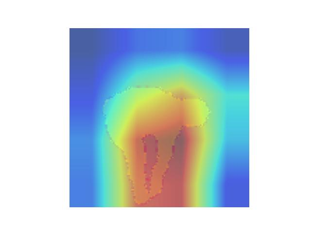
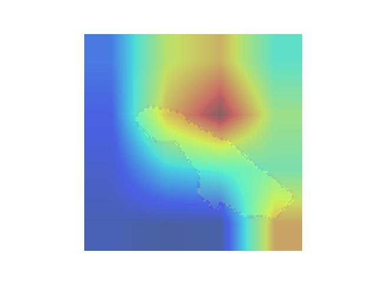
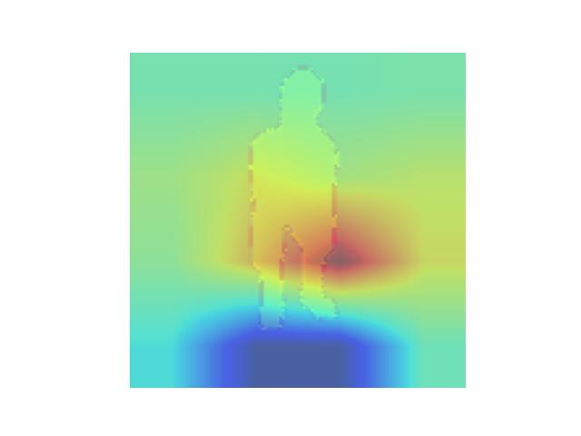
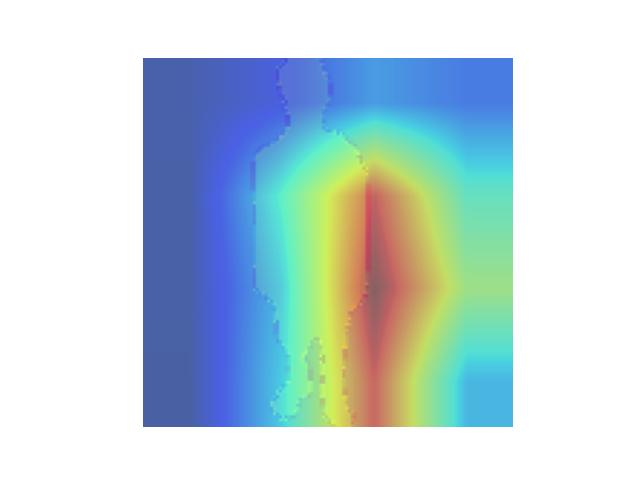

# MLP-Mixer for Silhouette
このプロジェクトはMLP-Mixerがシルエット画像を用いたデータセットに対して有効であるかを検証するためのプロジェクトです．
## 利用方法
1. まず以下の https://www.kaggle.com/datasets/deepshah16/silhouettes-of-human-posture/data からデータセットのダウンロードを行ってください．
2. データセットをプロジェクトに配置し，以下のプログラムで実行を行ってください．
```
python train.py
```
## 検証可能なネットワーク
- MLP-Mixer
- Vision Transformer
- Resnet 50
- CrossViT

## 推論プロセスの可視化
- gradcam
```
python -m utils.gradcam --image ./archive/lying/1.jpg --model ./resnet50/best.pt --output_path ./output_lying.jpg
```
上記のようなコマンドを実行し，推論プロセスの可視化を行います．ただし，このスクリプトはresnet50モデルにした適用できません．
### GradCamの結果



